# `crates/ggen-marketplace/src/marketplace/rdf/ontology.rs`

Source SHA-256: `46a9bf0669de12067e0c8d4878cee251ab08d1407cc6c4ea3ea6ceb75d6b0552`

```mermaid
classDiagram
    class mod_namespaces {
      <<mod>>
    }
    class struct_Ontology {
      <<struct>>
    }
    class struct_UriBuilder {
      <<struct>>
    }
    class enum_Class {
      <<enum>>
    }
    class enum_Property {
      <<enum>>
    }
    class enum_XsdType {
      <<enum>>
    }
    class fn_generate_prefixes {
      <<fn>>
    }
    class fn_generate_ontology_definition {
      <<fn>>
    }
    class mod_tests {
      <<mod>>
    }
    note "Class"
    note "Ontology"
    note "Property"
    note "UriBuilder"
    note "XsdType"
    note "fmt::Display for Class"
    note "fmt::Display for Property"
```

## Dependencies

- `crate::marketplace::ontology::MARKETPLACE_NS`
- `crate::marketplace::ontology::Properties as Canonical`
- `namespaces::GGEN as GGEN_NS`
- `std::fmt`
- `super::*`
- `super::MARKETPLACE_NS`

## Standing

- Structural parse: `ALIVE`
- Runtime behavior: `UNKNOWN`
