# `crates/ggen-marketplace/src/marketplace/rdf/poka_yoke.rs`

Source SHA-256: `c4b8c45abe09aefac3905288211397f0c62ca0e1bb84fc8cba6373d9b85d3e6f`

```mermaid
classDiagram
    class mod_typestate {
      <<mod>>
    }
    class struct_ResourceId {
      <<struct>>
    }
    class enum_Literal {
      <<enum>>
    }
    class struct_Triple {
      <<struct>>
      +"subject: ResourceId"
      +"predicate: ResourceId"
      +"object: TripleObject"
      +"metadata: Option~Kgc4dMetadata~"
    }
    class struct_Kgc4dMetadata {
      <<struct>>
      +"observable: ResourceId"
      +"timestamp: String"
      +"vector_clock: String"
      +"commit_hash: String"
    }
    class enum_TripleObject {
      <<enum>>
    }
    class struct_TripleBuilder {
      <<struct>>
      +"subject: Option~ResourceId~"
      +"predicate: Option~ResourceId~"
      +"object: Option~TripleObject~"
      +"metadata: Option~Kgc4dMetadata~"
      +"_state: PhantomData~State~"
    }
    class struct_SparqlQuery {
      <<struct>>
      +"prefixes: Vec~(String"
      +"select_vars: Vec~String~"
      +"where_patterns: Vec~String~"
      +"filters: Vec~String~"
      +"order_by: Vec~String~"
      +"limit: Option~usize~"
      +"offset: Option~usize~"
      +"_state: PhantomData~State~"
    }
    class struct_RdfGraph {
      <<struct>>
      +"store: Store"
      +"named_graph: Option~ResourceId~"
    }
    class struct_ValidationConstraint {
      <<struct>>
      +"target_class: Class"
      +"property: Property"
      +"constraint_type: ConstraintType"
    }
    class enum_ConstraintType {
      <<enum>>
    }
    class enum_PokaYokeError {
      <<enum>>
    }
    class mod_tests {
      <<mod>>
    }
    note "Default for RdfGraph"
    note "Default for SparqlQuery~typestate::Building~"
    note "Literal"
    note "RdfGraph"
    note "ResourceId"
    note "SparqlQuery~typestate::Building~"
    note "SparqlQuery~typestate::Validated~"
    note "Triple"
    note "TripleBuilder~typestate::Complete~"
    note "TripleBuilder~typestate::HasPredicate~"
    note "TripleBuilder~typestate::HasSubject~"
    note "TripleBuilder~typestate::NoSubject~"
    note "ValidationConstraint"
    note "fmt::Display for PokaYokeError"
    note "fmt::Display for ResourceId"
    note "std::error::Error for PokaYokeError"
```

## Dependencies

- `crate::marketplace::rdf::ontology::namespaces`
- `oxigraph::model::{Literal as OxiLiteral, NamedNode, Quad, Term, Triple as OxiTriple}`
- `oxigraph::store::Store`
- `serde::{Deserialize, Serialize}`
- `std::fmt::{self, Write}`
- `std::marker::PhantomData`
- `super::*`
- `super::ontology::{Class, Property, XsdType}`

## Standing

- Structural parse: `ALIVE`
- Runtime behavior: `UNKNOWN`
