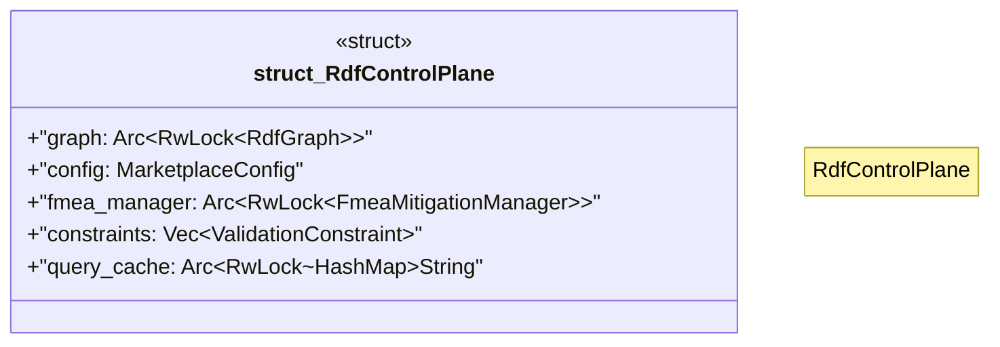

# `crates/ggen-marketplace/src/marketplace/rdf/rdf_control.rs`

Source SHA-256: `cb42e5c3564d1e95453b3e33bdd493fe01f8bbc4f9c8e1b627e882eddf36e638`

## Dependencies

- `crate::marketplace::ontology::MARKETPLACE_NS`
- `std::collections::HashMap`
- `std::sync::{Arc, RwLock}`
- `super::fmea_mitigations::FmeaMitigationManager`
- `super::ontology::{Class, Property}`
- `super::poka_yoke::{ typestate, Literal, PokaYokeError, RdfGraph, ResourceId, SparqlQuery, Triple, ValidationConstraint, }`
- `super::sparql_queries::{MarketplaceQueries, PackageSearchResult, SearchParams}`
- `super::turtle_config::{ConfigError, MarketplaceConfig, TurtleConfigLoader}`
- `tracing::{info, warn}`

## Standing

- Structural parse: `ALIVE`
- Runtime behavior: `UNKNOWN`
