# `crates/ggen-marketplace/src/marketplace/rdf/sparql.rs`

Source SHA-256: `36816c1f9d0ba46d7bf0334dbf537b3f3d0aefa5d2780f6c309e184a5288015b`

```mermaid
classDiagram
    class fn_generate_prefixes {
      <<fn>>
    }
    class fn_package_uri {
      <<fn>>
    }
    class fn_version_uri {
      <<fn>>
    }
    class fn_author_uri {
      <<fn>>
    }
    class struct_SparqlExecutor {
      <<struct>>
      +"store: Arc~Store~"
    }
    class struct_SparqlQueryBuilder {
      <<struct>>
      +"prefixes: String"
      +"select_vars: Vec~String~"
      +"where_clauses: Vec~String~"
      +"filters: Vec~String~"
      +"order_by: Option~String~"
      +"limit: Option~usize~"
      +"offset: Option~usize~"
    }
    class struct_SparqlQuery {
      <<struct>>
    }
    class struct_SparqlResultParser {
      <<struct>>
    }
    class struct_PackageQueryResult {
      <<struct>>
      +"id: PackageId"
      +"name: String"
      +"description: String"
      +"version: PackageVersion"
      +"license: String"
      +"quality_score: Option~QualityScore~"
      +"created_at: Option~String~"
      +"updated_at: Option~String~"
    }
    class struct_SearchQueryResult {
      <<struct>>
      +"package: PackageQueryResult"
      +"relevance: f64"
    }
    class struct_DependencyQueryResult {
      <<struct>>
      +"package_id: PackageId"
      +"version_requirement: String"
      +"is_optional: bool"
    }
    class struct_MaturityMetrics {
      <<struct>>
      +"quality_score: Option~QualityScore~"
      +"download_count: u64"
      +"version_count: usize"
      +"last_update: Option~String~"
      +"test_coverage: Option~f64~"
    }
    class struct_DashboardStats {
      <<struct>>
      +"total_packages: usize"
      +"average_quality: f64"
      +"total_downloads: u64"
    }
    class mod_tests {
      <<mod>>
    }
    note "Default for SparqlQueryBuilder"
    note "SparqlExecutor"
    note "SparqlQuery"
    note "SparqlQueryBuilder"
    note "SparqlResultParser"
```

## Dependencies

- `crate::marketplace::error::{Error, Result}`
- `crate::marketplace::models::{PackageId, PackageVersion, QualityScore}`
- `crate::marketplace::ontology::MARKETPLACE_NS`
- `oxigraph::model::{Quad, Term}`
- `oxigraph::sparql::{QueryResults, QuerySolution}`
- `oxigraph::store::Store`
- `serde::{Deserialize, Serialize}`
- `std::fmt::Write`
- `std::sync::Arc`
- `super::*`
- `super::ontology::namespaces`

## Standing

- Structural parse: `ALIVE`
- Runtime behavior: `UNKNOWN`
