# `crates/ggen-marketplace/src/marketplace/rdf/sparql_queries.rs`

Source SHA-256: `c7b8a76dcf194b630e8147ab284356e5d2c1e8ee25e252cfee04b97fab08bb66`

```mermaid
classDiagram
    class struct_SearchParams {
      <<struct>>
      +"query: Option~String~"
      +"category: Option~String~"
      +"tags: Vec~String~"
      +"author: Option~String~"
      +"min_rating: Option~f64~"
      +"limit: Option~usize~"
      +"offset: Option~usize~"
    }
    class struct_PackageSearchResult {
      <<struct>>
      +"package_id: String"
      +"name: String"
      +"description: Option~String~"
      +"version: String"
      +"author: Option~String~"
      +"rating: Option~f64~"
      +"download_count: Option~i64~"
      +"published_at: Option~String~"
    }
    class struct_InstallationRecord {
      <<struct>>
      +"package_id: String"
      +"version: String"
      +"installed_at: String"
      +"status: String"
      +"install_path: String"
    }
    class struct_ValidationRecord {
      <<struct>>
      +"package_id: String"
      +"version: String"
      +"validated_at: String"
      +"status: String"
      +"violations: Vec~String~"
    }
    class struct_DependencyInfo {
      <<struct>>
      +"package_id: String"
      +"dependency_id: String"
      +"dependency_version: String"
      +"dependency_type: String"
      +"is_optional: bool"
    }
    class struct_MarketplaceQueries {
      <<struct>>
    }
    class mod_tests {
      <<mod>>
    }
    note "MarketplaceQueries"
```

## Dependencies

- `serde::{Deserialize, Serialize}`
- `super::*`
- `super::ontology::{namespaces, Property}`
- `super::poka_yoke::{typestate, PokaYokeError, SparqlQuery}`

## Standing

- Structural parse: `ALIVE`
- Runtime behavior: `UNKNOWN`
