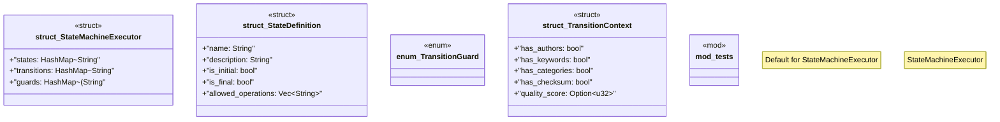

# `crates/ggen-marketplace/src/marketplace/rdf/state_machine.rs`

Source SHA-256: `915b7982cce6189929a3c07c237917fd054980b1224d261749a6842e777087a3`

## Dependencies

- `crate::marketplace::error::{Error, Result}`
- `serde::{Deserialize, Serialize}`
- `std::collections::{HashMap, HashSet}`
- `super::*`
- `super::turtle_config::TurtleConfigLoader`

## Standing

- Structural parse: `ALIVE`
- Runtime behavior: `UNKNOWN`
