# `crates/ggen-marketplace/src/marketplace/rdf/turtle_config.rs`

Source SHA-256: `33c049c85710ff3dc5798cb03045b132f6f907a48552a77686a3dc24d9368260`

```mermaid
classDiagram
    class struct_MarketplaceConfig {
      <<struct>>
      +"registry_url: String"
      +"cache_dir: String"
      +"max_download_size: u64"
      +"validation_enabled: bool"
      +"auto_update_enabled: bool"
      +"telemetry_enabled: bool"
      +"registries: Vec~RegistryConfig~"
      +"validation_rules: Vec~String~"
    }
    class struct_RegistryConfig {
      <<struct>>
      +"name: String"
      +"url: String"
      +"priority: u32"
      +"enabled: bool"
      +"auth_required: bool"
    }
    class struct_TurtleConfigLoader {
      <<struct>>
      +"config_dir: String"
    }
    class fn_extract_string_value {
      <<fn>>
    }
    class fn_extract_integer_value {
      <<fn>>
    }
    class fn_extract_boolean_value {
      <<fn>>
    }
    class fn_save_marketplace_config {
      <<fn>>
    }
    class fn_generate_marketplace_turtle {
      <<fn>>
    }
    class struct_StateMachine {
      <<struct>>
      +"id: String"
      +"name: String"
      +"initial_state: String"
      +"states: Vec~State~"
      +"transitions: Vec~Transition~"
    }
    class struct_State {
      <<struct>>
      +"id: String"
      +"label: String"
      +"is_final: bool"
    }
    class struct_Transition {
      <<struct>>
      +"from_state: String"
      +"to_state: String"
      +"event: String"
      +"conditions: Vec~String~"
    }
    class enum_ConfigError {
      <<enum>>
    }
    class mod_tests {
      <<mod>>
    }
    note "TurtleConfigLoader"
    note "std::error::Error for ConfigError"
    note "std::fmt::Display for ConfigError"
```

## Dependencies

- `serde::{Deserialize, Serialize}`
- `std::fmt::Write`
- `std::fs`
- `super::*`
- `super::ontology::generate_prefixes`

## Standing

- Structural parse: `ALIVE`
- Runtime behavior: `UNKNOWN`
