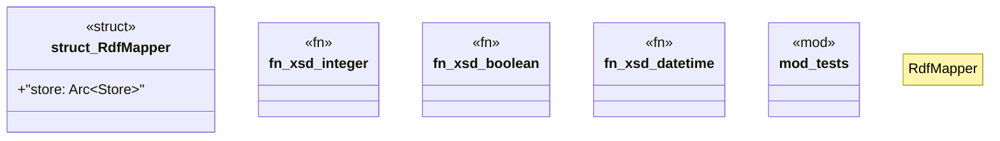

# `crates/ggen-marketplace/src/marketplace/rdf_mapper.rs`

Source SHA-256: `77fe97aceaee0a17ba87aab745a9ecc446db55d3371db965757204f96977f3e8`

## Dependencies

- `chrono::{DateTime, Utc}`
- `crate::marketplace::error::{Error, Result}`
- `crate::marketplace::models::{ Package, PackageId, PackageMetadata, PackageVersion, ReleaseInfo, }`
- `crate::marketplace::models::{PackageMetadata, PackageVersion}`
- `crate::marketplace::ontology::{Classes, Namespaces, Properties}`
- `crate::marketplace::trust::RegistryType`
- `oxigraph::model::{GraphNameRef, Literal, NamedNode, QuadRef, Term}`
- `oxigraph::store::Store`
- `std::sync::Arc`
- `super::*`
- `tracing::debug`

## Standing

- Structural parse: `ALIVE`
- Runtime behavior: `UNKNOWN`
