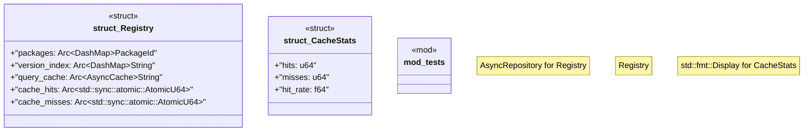

# `crates/ggen-marketplace/src/marketplace/registry.rs`

Source SHA-256: `c40b93d99ca393b11a0ff46720f2e3684eec19790a3f701d13c905c6ac03a09a`

## Dependencies

- `async_trait::async_trait`
- `crate::marketplace::error::Result`
- `crate::marketplace::models::{Package, PackageId, PackageVersion}`
- `crate::marketplace::models::{PackageId, PackageMetadata}`
- `crate::marketplace::traits::AsyncRepository`
- `dashmap::DashMap`
- `moka::future::Cache as AsyncCache`
- `std::sync::Arc`
- `super::*`
- `tracing::{debug, info, warn}`

## Standing

- Structural parse: `ALIVE`
- Runtime behavior: `UNKNOWN`
