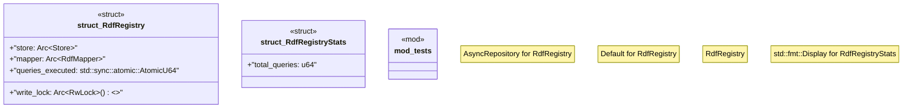

# `crates/ggen-marketplace/src/marketplace/registry_rdf.rs`

Source SHA-256: `c0daa2af210821931aaf180de5d1fd37c23123c2bc61477087e85bbbde0541ad`

## Dependencies

- `async_trait::async_trait`
- `crate::marketplace::error::Result`
- `crate::marketplace::models::PackageMetadata`
- `crate::marketplace::models::{Package, PackageId, PackageVersion, SearchResult}`
- `crate::marketplace::ontology::MARKETPLACE_NS`
- `crate::marketplace::rdf_mapper::RdfMapper`
- `crate::marketplace::traits::AsyncRepository`
- `indexmap::IndexMap`
- `oxigraph::model::{GraphNameRef, NamedNode, QuadRef, Term}`
- `oxigraph::store::Store`
- `parking_lot::RwLock`
- `std::sync::Arc`
- `super::*`
- `tracing::{debug, info}`

## Standing

- Structural parse: `ALIVE`
- Runtime behavior: `UNKNOWN`
