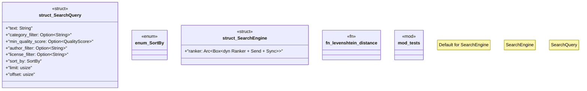

# `crates/ggen-marketplace/src/marketplace/search.rs`

Source SHA-256: `e0ea12fbd2f2e050b321cd2d797966a0e3771724d31040c30993a913c71b536d`

## Dependencies

- `crate::marketplace::error::Result`
- `crate::marketplace::models::{Package, QualityScore, SearchResult}`
- `crate::marketplace::traits::{DefaultRanker, Ranker}`
- `std::sync::Arc`
- `super::*`
- `tracing::debug`

## Standing

- Structural parse: `ALIVE`
- Runtime behavior: `UNKNOWN`
