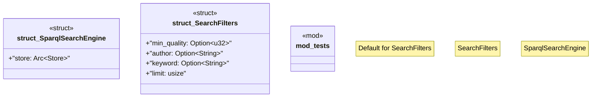

# `crates/ggen-marketplace/src/marketplace/search_sparql.rs`

Source SHA-256: `4a3a9e70b13f10396ed8416f086bf76efa8d8ee9ff6d1a567f77280432ab7f6c`

## Dependencies

- `crate::marketplace::error::Result`
- `crate::marketplace::ontology::Queries`
- `oxigraph::store::Store`
- `std::sync::Arc`
- `super::*`
- `tracing::debug`

## Standing

- Structural parse: `ALIVE`
- Runtime behavior: `UNKNOWN`
