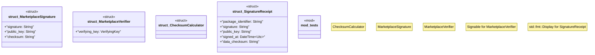

# `crates/ggen-marketplace/src/marketplace/security.rs`

Source SHA-256: `e3265b7f3bbde86904186963d2f80926dd303467ada5a58c9d311cf6df69f157`

## Dependencies

- `chrono::{DateTime, Utc}`
- `crate::marketplace::error::Result`
- `crate::marketplace::traits::Signable`
- `ed25519_dalek::Signature`
- `ed25519_dalek::{Signer, SigningKey, Verifier, VerifyingKey}`
- `ggen_config::generate_keypair as generate_marketplace_keypair`
- `ggen_config::hash_data`
- `super::*`
- `tracing::{debug, instrument}`

## Standing

- Structural parse: `ALIVE`
- Runtime behavior: `UNKNOWN`
