# `crates/ggen-marketplace/src/marketplace/traits.rs`

Source SHA-256: `761a6e3dc803ee879bb9be7b9057b8958dec224b4a775a623aa5a6839fca1e11`

```mermaid
classDiagram
    class trait_AsyncRepository {
      <<trait>>
      +"get_package(&self, id: &PackageId) -~ Result~Package~"
      +"get_package_version(
        &self, id: &PackageId, version: &PackageVersion,
    ) -~ Result~Package~"
      +"all_packages(&self) -~ Result~Vec~Package~~"
      +"list_versions(&self, id: &PackageId) -~ Result~Vec~PackageVersion~~"
      +"package_exists(&self, id: &PackageId) -~ Result~bool~"
    }
    class trait_Queryable {
      <<trait>>
      +"query(&self, query: Self::Query) -~ Result~Self::QueryResult~"
      +"explain_query(&self, query: &Self::Query) -~ String"
    }
    class trait_Installable {
      <<trait>>
      +"install(&self, manifest: InstallationManifest) -~ Result~InstallationManifest~"
      +"resolve_dependencies(
        &self, id: &PackageId, version: &PackageVersion,
    ) -~ Result~Vec~(PackageId, PackageVersion)~~"
      +"dry_run_install(&self, manifest: &InstallationManifest) -~ Result~String~"
    }
    class trait_Validatable {
      <<trait>>
      +"validate(&self, package: &Package) -~ Result~Self::ValidationResult~"
      +"validate_manifest(&self, manifest: &Manifest) -~ Result~Self::ValidationResult~"
      +"validation_passes(&self, result: &Self::ValidationResult) -~ bool"
    }
    class trait_Signable {
      <<trait>>
      +"sign(&self, data: &[u8]) -~ Result~String~"
      +"verify(&self, data: &[u8], signature: &str) -~ Result~bool~"
      +"public_key(&self) -~ String"
    }
    class trait_Observable {
      <<trait>>
      +"record_metric(&self, name: &str, value: f64) -~ Result~()~"
      +"record_event(&self, name: &str, data: &str) -~ Result~()~"
      +"get_metrics(&self) -~ Result~String~"
    }
    class trait_Cache {
      <<trait>>
      +"get(&self, key: &K) -~ Option~V~"
      +"insert(&self, key: K, value: V)"
      +"remove(&self, key: &K) -~ Option~V~"
      +"clear(&self)"
      +"size(&self) -~ usize"
    }
    class trait_Builder {
      <<trait>>
      +"build(self) -~ Result~T~"
      +"validate(&self) -~ Result~()~"
    }
    class trait_Filter {
      <<trait>>
      +"matches(&self, item: &T) -~ bool"
      +"filter_items(&self, items: Vec~T~) -~ Vec~T~"
    }
    class trait_Transformer {
      <<trait>>
      +"transform(&self, item: T) -~ Result~U~"
      +"transform_batch(&self, items: Vec~T~) -~ Result~Vec~U~~"
    }
    class trait_Ranker {
      <<trait>>
      +"rank(&self, results: &mut [SearchResult])"
    }
    class struct_DefaultRanker {
      <<struct>>
    }
    class mod_tests {
      <<mod>>
    }
    note "Ranker for DefaultRanker"
```

## Dependencies

- `async_trait::async_trait`
- `crate::marketplace::error::Result`
- `crate::marketplace::models::{ InstallationManifest, Manifest, Package, PackageId, PackageVersion, SearchResult, }`
- `super::*`

## Standing

- Structural parse: `ALIVE`
- Runtime behavior: `UNKNOWN`
