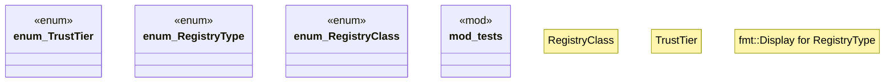

# `crates/ggen-marketplace/src/marketplace/trust.rs`

Source SHA-256: `aae99bba9f78446b9dfca996731b6869b8df1cb1fc2ac45c1ea3d7db3d692385`

## Dependencies

- `serde::{Deserialize, Serialize}`
- `std::fmt`
- `super::*`

## Standing

- Structural parse: `ALIVE`
- Runtime behavior: `UNKNOWN`
