# `crates/ggen-marketplace/src/marketplace/v3.rs`

Source SHA-256: `8f83b291423b8f71d3f350d2029c2c08781b6329a20f1f410cfaafebb9b34379`

```mermaid
classDiagram
    class struct_V3OptimizedRegistry {
      <<struct>>
      +"primary_store: Arc~Store~"
      +"replica_store: Option~Arc~Store~~"
      +"hot_query_cache: Arc~AsyncCache~String"
      +"metadata_cache: Arc~AsyncCache~String"
      +"query_plan_cache: Arc~parking_lot::RwLock~LruCache~String"
      +"search_index: Arc~parking_lot::RwLock~indexmap::IndexMap~String"
      +"query_stats: Arc~QueryStats~"
      +"metrics: Arc~V3Metrics~"
    }
    class struct_QueryStats {
      <<struct>>
      +"total_queries: std::sync::atomic::AtomicU64"
      +"hot_cache_hits: std::sync::atomic::AtomicU64"
      +"metadata_cache_hits: std::sync::atomic::AtomicU64"
      +"query_plan_cache_hits: std::sync::atomic::AtomicU64"
      +"store_queries: std::sync::atomic::AtomicU64"
      +"total_latency_us: std::sync::atomic::AtomicU64"
    }
    class struct_V3Metrics {
      <<struct>>
      +"cache_hits: std::sync::atomic::AtomicU64"
      +"cache_misses: std::sync::atomic::AtomicU64"
      +"batch_ops: std::sync::atomic::AtomicU64"
      +"parallel_searches: std::sync::atomic::AtomicU64"
      +"cache_size: std::sync::atomic::AtomicU64"
      +"search_index_entries: std::sync::atomic::AtomicU64"
      +"latency_buckets: [std::sync::atomic::AtomicU64; 8]"
    }
    class struct_V3RegistryStats {
      <<struct>>
      +"total_queries: u64"
      +"hot_cache_hits: u64"
      +"metadata_cache_hits: u64"
      +"query_plan_cache_hits: u64"
      +"store_queries: u64"
      +"avg_latency_us: u64"
      +"cache_hit_rate: f64"
      +"metrics_cache_hits: u64"
      +"metrics_cache_misses: u64"
      +"metrics_cache_size: u64"
    }
    class struct_V3MetricsSnapshot {
      <<struct>>
      +"cache_hits: u64"
      +"cache_misses: u64"
      +"batch_ops: u64"
      +"parallel_searches: u64"
      +"cache_size: u64"
      +"search_index_entries: u64"
      +"latency_buckets: [u64; 8]"
    }
    class mod_tests {
      <<mod>>
    }
    note "AsyncRepository for V3OptimizedRegistry"
    note "V3OptimizedRegistry"
    note "std::fmt::Display for V3MetricsSnapshot"
    note "std::fmt::Display for V3RegistryStats"
```

## Dependencies

- `async_trait::async_trait`
- `crate::marketplace::error::{Error, Result}`
- `crate::marketplace::models::{Manifest, Package, PackageId, PackageVersion}`
- `crate::marketplace::ontology::MARKETPLACE_NS`
- `crate::marketplace::traits::AsyncRepository`
- `lru::LruCache`
- `moka::future::Cache as AsyncCache`
- `oxigraph::store::Store`
- `rayon::prelude::*`
- `std::num::NonZeroUsize`
- `std::sync::Arc`
- `std::time::{Duration, Instant}`
- `super::*`
- `tracing::{debug, info, warn}`

## Standing

- Structural parse: `ALIVE`
- Runtime behavior: `UNKNOWN`
