# `crates/ggen-marketplace/src/marketplace/validation.rs`

Source SHA-256: `fe881a7b9bdf911ea895424091fdbb7d80063d0326cd5dc994efb1a094f07986`

```mermaid
classDiagram
    class struct_ValidationResult {
      <<struct>>
      +"passed: bool"
      +"quality_score: u32"
      +"checks: Vec~ValidationCheck~"
    }
    class struct_ValidationCheck {
      <<struct>>
      +"name: String"
      +"passed: bool"
      +"severity: CheckSeverity"
      +"message: String"
      +"weight: u32"
    }
    class enum_CheckSeverity {
      <<enum>>
    }
    class trait_Validator {
      <<trait>>
      +"validate(&self, package: &Package) -~ Result~ValidationCheck~"
      +"name(&self) -~ &str"
      +"weight(&self) -~ u32"
    }
    class struct_PackageValidator {
      <<struct>>
      +"validators: Vec~Arc~dyn Validator~~"
    }
    class struct_MetadataValidator {
      <<struct>>
    }
    class struct_LicenseValidator {
      <<struct>>
    }
    class struct_ReadmeValidator {
      <<struct>>
    }
    class struct_RepositoryValidator {
      <<struct>>
    }
    class struct_AuthorValidator {
      <<struct>>
    }
    class mod_tests {
      <<mod>>
    }
    note "Default for PackageValidator"
    note "PackageValidator"
    note "Validatable for PackageValidator"
    note "Validator for AuthorValidator"
    note "Validator for LicenseValidator"
    note "Validator for MetadataValidator"
    note "Validator for ReadmeValidator"
    note "Validator for RepositoryValidator"
```

## Dependencies

- `async_trait::async_trait`
- `crate::marketplace::error::Result`
- `crate::marketplace::models::{Manifest, Package}`
- `crate::marketplace::models::{PackageId, PackageMetadata}`
- `crate::marketplace::traits::Validatable`
- `semver::Version`
- `std::sync::Arc`
- `super::*`
- `tracing::info`

## Standing

- Structural parse: `ALIVE`
- Runtime behavior: `UNKNOWN`
