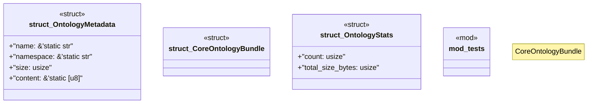

# `crates/ggen-marketplace/src/ontology_core/core_bundle.rs`

Source SHA-256: `00d75bb79536434228a3b16505ef4d5105cc5f003611791f6448c180b883ced7`

## Dependencies

- `super::*`

## Standing

- Structural parse: `ALIVE`
- Runtime behavior: `UNKNOWN`
