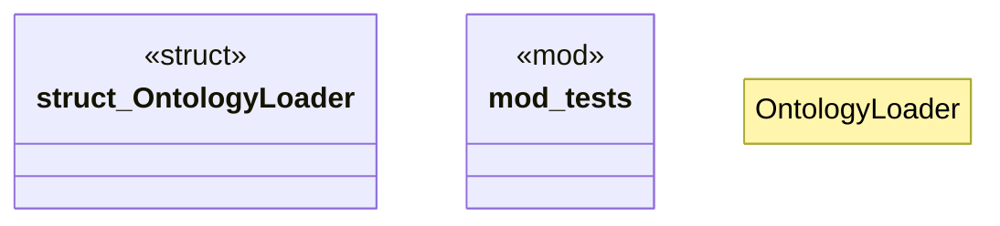

# `crates/ggen-marketplace/src/ontology_core/loader.rs`

Source SHA-256: `e3c9b55980b59a062a8253c584bed02f2632f989a3912e5b235a725f6818ab99`

## Dependencies

- `crate::ontology_core::resolver::OntologyResolver`
- `std::path::Path`
- `super::*`

## Standing

- Structural parse: `ALIVE`
- Runtime behavior: `UNKNOWN`
