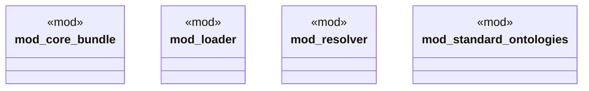

# `crates/ggen-marketplace/src/ontology_core/mod.rs`

Source SHA-256: `873faab63c4b554eb3744ffeb11e94716a944ba828bdb310d337bb4db3c286fc`

## Dependencies

- `core_bundle::{CoreOntologyBundle, OntologyMetadata, OntologyStats}`
- `loader::OntologyLoader`
- `standard_ontologies::{get_standard_namespaces, NamespaceInfo, StandardOntology}`

## Standing

- Structural parse: `ALIVE`
- Runtime behavior: `UNKNOWN`
