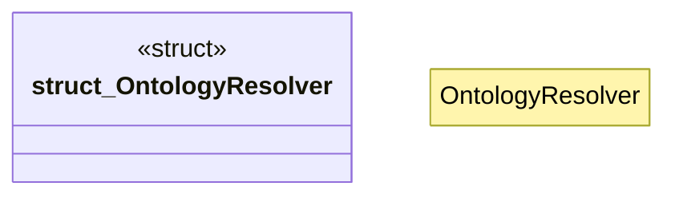

# `crates/ggen-marketplace/src/ontology_core/resolver.rs`

Source SHA-256: `c9894de8ab334702835490d626f1a0f30a92e037587cef738dc26df026aca3ec`

## Dependencies

- `std::path::{Path, PathBuf}`
- `walkdir::WalkDir`

## Standing

- Structural parse: `ALIVE`
- Runtime behavior: `UNKNOWN`
