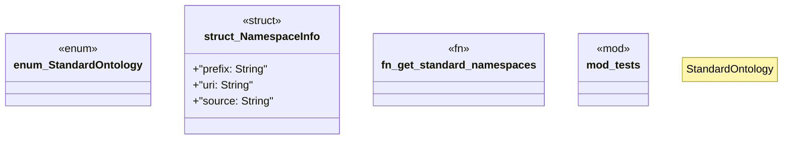

# `crates/ggen-marketplace/src/ontology_core/standard_ontologies.rs`

Source SHA-256: `9ed9767d8f12643399e46eac5d45212343156bf8b76b77ee143fdd69096629af`

## Dependencies

- `super::*`

## Standing

- Structural parse: `ALIVE`
- Runtime behavior: `UNKNOWN`
