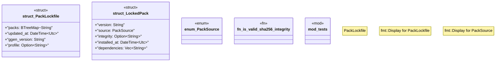

# `crates/ggen-marketplace/src/packs/lockfile.rs`

Source SHA-256: `152460e852a8eeed4194c2e4c48aec4d44c70a4eb65d5b5fa8496a993fcd5dd9`

## Dependencies

- `chrono::{DateTime, Utc}`
- `crate::marketplace::error::{Error, Result}`
- `serde::{Deserialize, Serialize}`
- `std::collections::BTreeMap`
- `std::fmt`
- `std::fs`
- `std::path::{Path, PathBuf}`
- `super::*`
- `tempfile::TempDir`

## Standing

- Structural parse: `ALIVE`
- Runtime behavior: `UNKNOWN`
