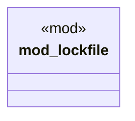

# `crates/ggen-marketplace/src/packs/mod.rs`

Source SHA-256: `052efc68ab512a15e430b5d98912d107d302c84eae2f6c1926d320e05e1287e8`

## Dependencies

- None observed.

## Standing

- Structural parse: `ALIVE`
- Runtime behavior: `UNKNOWN`
