# `crates/ggen-marketplace/src/packs_registry/advanced_resolver.rs`

Source SHA-256: `c3f9236c46219820da199886fb7a0f5695c4e0db0b84c5bf07cafc28b3753a7d`

```mermaid
classDiagram
    class struct_AdvancedResolver {
      <<struct>>
      +"registry_cache: HashMap~String"
    }
    class enum_ConflictResolution {
      <<enum>>
    }
    class struct_ResolvedDependencies {
      <<struct>>
      +"install_order: Vec~Package~"
      +"conflicts: Vec~Conflict~"
      +"resolutions: Vec~Resolution~"
    }
    class struct_Package {
      <<struct>>
      +"id: String"
      +"version: String"
      +"source_pack: String"
    }
    class struct_Conflict {
      <<struct>>
      +"package_id: String"
      +"versions: Vec~String~"
      +"requesters: HashMap~String"
      +"severity: ConflictSeverity"
    }
    class enum_ConflictSeverity {
      <<enum>>
    }
    class struct_Resolution {
      <<struct>>
      +"package_id: String"
      +"resolved_version: String"
      +"strategy: String"
      +"reason: String"
    }
    class struct_VersionConstraint {
      <<struct>>
      +"constraint_type: ConstraintType"
      +"version: String"
    }
    class enum_ConstraintType {
      <<enum>>
    }
    class mod_tests {
      <<mod>>
    }
    note "AdvancedResolver"
    note "Default for AdvancedResolver"
```

## Dependencies

- `crate::marketplace::error::{Error, Result}`
- `crate::packs_registry::types::Pack`
- `crate::packs_registry::types::PackMetadata`
- `serde::{Deserialize, Serialize}`
- `std::collections::HashMap`
- `std::collections::{HashMap, HashSet}`
- `super::*`
- `tracing::{info, warn}`

## Standing

- Structural parse: `ALIVE`
- Runtime behavior: `UNKNOWN`
