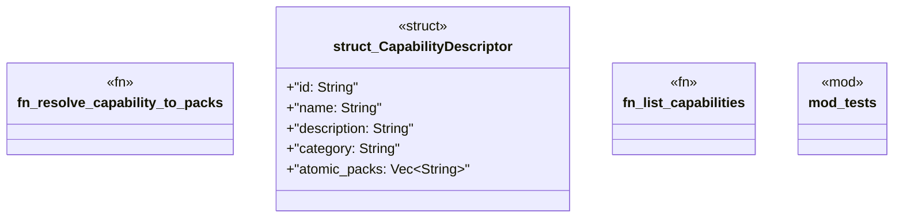

# `crates/ggen-marketplace/src/packs_registry/capability_registry.rs`

Source SHA-256: `88410c4ffd1da174dde7ac15a26c2f0d07e83da2f65e920f9f54279217198978`

## Dependencies

- `crate::packs_registry::metadata::load_pack_metadata`
- `super::*`

## Standing

- Structural parse: `ALIVE`
- Runtime behavior: `UNKNOWN`
