# `crates/ggen-marketplace/src/packs_registry/cloud_distribution.rs`

Source SHA-256: `39a99d40321896f295d2f614716820d6323227086bf57e74d236b37849cc7236`

```mermaid
classDiagram
    class trait_CloudDistribution {
      <<trait>>
      +"cache_pack(&self, pack: &Pack) -~ Result~CacheInfo~"
      +"download_from_cache(&self, pack_id: &str, local_path: &Path) -~ Result~()~"
      +"get_cache_stats(&self, pack_id: &str) -~ Result~CacheStats~"
    }
    class struct_CacheInfo {
      <<struct>>
      +"cdn_url: String"
      +"cache_key: String"
      +"ttl: Duration"
      +"hit_count: u64"
    }
    class struct_CacheStats {
      <<struct>>
      +"hits: u64"
      +"misses: u64"
      +"hit_ratio: f64"
      +"bandwidth_saved: u64"
      +"avg_download_time_ms: u64"
    }
    class struct_InMemoryCDN {
      <<struct>>
      +"cache: std::sync::Arc~tokio::sync::RwLock~std::collections::HashMap~String"
      +"stats: std::sync::Arc~tokio::sync::RwLock~std::collections::HashMap~String"
    }
    class mod_tests {
      <<mod>>
    }
    note "CloudDistribution for InMemoryCDN"
    note "Default for InMemoryCDN"
    note "InMemoryCDN"
```

## Dependencies

- `async_trait::async_trait`
- `crate::marketplace::error::{Error, Result}`
- `crate::packs_registry::types::Pack`
- `crate::packs_registry::types::PackMetadata`
- `serde::{Deserialize, Serialize}`
- `std::collections::HashMap`
- `std::path::Path`
- `std::time::Duration`
- `super::*`
- `tracing::{debug, info}`

## Standing

- Structural parse: `ALIVE`
- Runtime behavior: `UNKNOWN`
