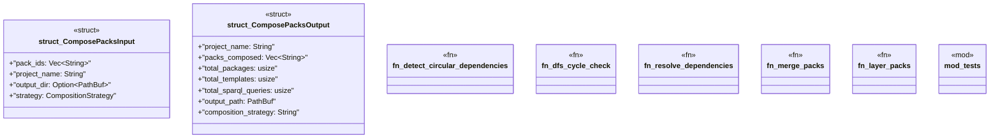

# `crates/ggen-marketplace/src/packs_registry/compose.rs`

Source SHA-256: `267ddec36342ab34971110fcffad40ae92c614a44eed109ebe590145fdaa423c`

## Dependencies

- `crate::marketplace::error::Result`
- `crate::packs_registry::metadata::load_pack_metadata`
- `crate::packs_registry::types::{CompositionStrategy, Pack}`
- `crate::packs_registry::types::{PackDependency, PackMetadata}`
- `serde::{Deserialize, Serialize}`
- `std::collections::{HashMap, HashSet}`
- `std::path::PathBuf`
- `super::*`

## Standing

- Structural parse: `ALIVE`
- Runtime behavior: `UNKNOWN`
