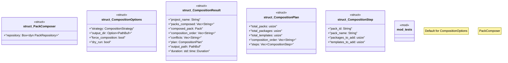

# `crates/ggen-marketplace/src/packs_registry/composer.rs`

Source SHA-256: `361e56046fd7bc48f3b13f3f5fc75e4045c1a1733b1598c5b913c4c113a053cd`

## Dependencies

- `crate::marketplace::error::{Error, Result}`
- `crate::packs_registry::dependency_graph::DependencyGraph`
- `crate::packs_registry::installer::{InstallOptions, PackInstaller}`
- `crate::packs_registry::repository::{FileSystemRepository, PackRepository}`
- `crate::packs_registry::types::{CompositionStrategy, Pack}`
- `crate::packs_registry::types::{PackDependency, PackMetadata, PackTemplate}`
- `std::collections::{HashMap, HashSet}`
- `std::path::PathBuf`
- `std::time::Instant`
- `super::*`
- `tracing::{info, warn}`

## Standing

- Structural parse: `ALIVE`
- Runtime behavior: `UNKNOWN`
