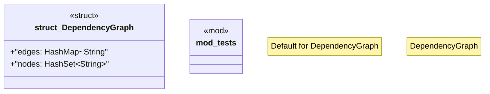

# `crates/ggen-marketplace/src/packs_registry/dependency_graph.rs`

Source SHA-256: `530c599ca94e636a4d019347fcdbff7fba9fd26dfb81b6c09dc3d6815f0dc168`

## Dependencies

- `crate::marketplace::error::{Error, Result}`
- `crate::packs_registry::types::Pack`
- `crate::packs_registry::types::{PackDependency, PackMetadata}`
- `std::collections::HashMap`
- `std::collections::{HashMap, HashSet, VecDeque}`
- `super::*`

## Standing

- Structural parse: `ALIVE`
- Runtime behavior: `UNKNOWN`
