# `crates/ggen-marketplace/src/packs_registry/external_fetcher.rs`

Source SHA-256: `cde9cd3af57f20119941ebf0f459e3cb7754b05d64e6138ba5a943d6f6e2247a`

```mermaid
classDiagram
    class struct_Package {
      <<struct>>
      +"id: String"
      +"name: String"
      +"latest_version: String"
      +"versions: Vec~String~"
      +"description: Option~String~"
      +"homepage: Option~String~"
      +"repository: Option~String~"
      +"license: Option~String~"
      +"download_urls: HashMap~String"
      +"checksums: HashMap~String"
    }
    class trait_ExternalRegistryFetcher {
      <<trait>>
      +"fetch_metadata(&self, package_id: &str) -~ Result~Package~"
      +"fetch_artifact(&self, package_id: &str, version: &str) -~ Result~Vec~u8~~"
      +"registry_prefix(&self) -~ &str"
    }
    class struct_CratesIoFetcher {
      <<struct>>
      +"client: reqwest::Client"
    }
    class struct_NpmFetcher {
      <<struct>>
      +"client: reqwest::Client"
    }
    class struct_PyPiFetcher {
      <<struct>>
      +"client: reqwest::Client"
    }
    class struct_ExternalFetcherFactory {
      <<struct>>
    }
    class mod_tests {
      <<mod>>
    }
    note "CratesIoFetcher"
    note "Default for CratesIoFetcher"
    note "Default for NpmFetcher"
    note "Default for PyPiFetcher"
    note "ExternalFetcherFactory"
    note "ExternalRegistryFetcher for CratesIoFetcher"
    note "ExternalRegistryFetcher for NpmFetcher"
    note "ExternalRegistryFetcher for PyPiFetcher"
    note "NpmFetcher"
    note "PyPiFetcher"
```

## Dependencies

- `async_trait::async_trait`
- `crate::marketplace::error::{Error, Result}`
- `reqwest::header::{HeaderMap, HeaderValue, USER_AGENT}`
- `serde::{Deserialize, Serialize}`
- `serde_json::json`
- `std::collections::HashMap`
- `super::*`
- `tracing::info`

## Standing

- Structural parse: `ALIVE`
- Runtime behavior: `UNKNOWN`
