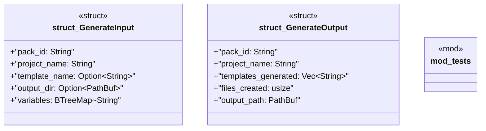

# `crates/ggen-marketplace/src/packs_registry/generator.rs`

Source SHA-256: `f0348d5840d86f741f45c98518140cb7b932d513c50c0381653763a172d1afb4`

## Dependencies

- `crate::marketplace::error::Result`
- `crate::packs_registry::metadata::load_pack_metadata`
- `serde::{Deserialize, Serialize}`
- `std::collections::BTreeMap`
- `std::path::PathBuf`
- `super::*`

## Standing

- Structural parse: `ALIVE`
- Runtime behavior: `UNKNOWN`
