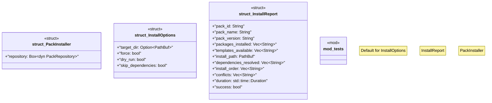

# `crates/ggen-marketplace/src/packs_registry/installer.rs`

Source SHA-256: `1ca946db1bf9a6f92b1c8bc5e483bdb2799d537a73df09a7280c8d8bff1c8d3e`

## Dependencies

- `crate::marketplace::error::{Error, Result}`
- `crate::packs::lockfile::{LockedPack, PackLockfile, PackSource}`
- `crate::packs_registry::dependency_graph::DependencyGraph`
- `crate::packs_registry::repository::{FileSystemRepository, PackRepository}`
- `crate::packs_registry::types::Pack`
- `std::collections::HashMap`
- `std::path::PathBuf`
- `std::time::Instant`
- `super::*`
- `tracing::{error, info, warn}`

## Standing

- Structural parse: `ALIVE`
- Runtime behavior: `UNKNOWN`
