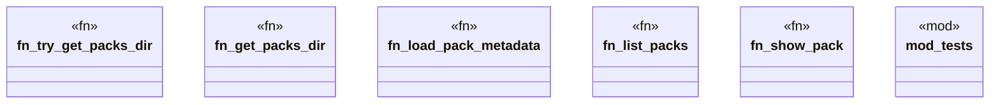

# `crates/ggen-marketplace/src/packs_registry/metadata.rs`

Source SHA-256: `1b13ae351952403acd7355b871e9890f2b26fd76ca15e34e3eb14e14c804b129`

## Dependencies

- `crate::marketplace::error::Result`
- `crate::packs_registry::types::{Pack, PackFile}`
- `serial_test::serial`
- `std::fs`
- `std::path::PathBuf`
- `super::*`

## Standing

- Structural parse: `ALIVE`
- Runtime behavior: `UNKNOWN`
