# `crates/ggen-marketplace/src/packs_registry/mod.rs`

Source SHA-256: `abb69099ff79feee521877922de4ee4323419dff73298fe4f5d8b7b34cd9ce76`

```mermaid
classDiagram
    class mod_capability_registry {
      <<mod>>
    }
    class mod_compose {
      <<mod>>
    }
    class mod_dependency_graph {
      <<mod>>
    }
    class mod_external_fetcher {
      <<mod>>
    }
    class mod_generator {
      <<mod>>
    }
    class mod_metadata {
      <<mod>>
    }
    class mod_registry {
      <<mod>>
    }
    class mod_repository {
      <<mod>>
    }
    class mod_template_generator {
      <<mod>>
    }
    class mod_types {
      <<mod>>
    }
    class mod_validate {
      <<mod>>
    }
    class struct_CheckCompatibilityResult {
      <<struct>>
      +"compatible: bool"
      +"pack_ids: Vec~String~"
      +"conflicts: Vec~String~"
      +"warnings: Vec~String~"
      +"message: String"
    }
    class struct_LoadedPack {
      <<struct>>
      +"id: String"
      +"name: String"
      +"packages: Vec~String~"
      +"dependencies: Vec~String~"
    }
```

## Dependencies

- `crate::marketplace::error::Error`
- `serde::Serialize`

## Standing

- Structural parse: `ALIVE`
- Runtime behavior: `UNKNOWN`
