# `crates/ggen-marketplace/src/packs_registry/registry.rs`

Source SHA-256: `c762c6e651bc9f665dcd79409497a7d2b13413b97d8e249da77ac01a742e5dd4`

```mermaid
classDiagram
    class trait_PackRegistry {
      <<trait>>
      +"publish(&self, pack: &Pack, metadata: PublishMetadata) -~ Result~PublishReceipt~"
      +"unpublish(&self, pack_id: &str, version: &str) -~ Result~()~"
      +"search(&self, query: &SearchQuery) -~ Result~Vec~Pack~~"
      +"get_versions(&self, pack_id: &str) -~ Result~Vec~Version~~"
    }
    class struct_PublishMetadata {
      <<struct>>
      +"version: String"
      +"changelog: String"
      +"tags: Vec~String~"
      +"documentation_url: Option~String~"
    }
    class struct_PublishReceipt {
      <<struct>>
      +"pack_id: String"
      +"version: String"
      +"registry_url: String"
      +"published_at: String"
    }
    class struct_SearchQuery {
      <<struct>>
      +"text: Option~String~"
      +"category: Option~String~"
      +"tags: Vec~String~"
      +"author: Option~String~"
      +"production_ready_only: bool"
      +"limit: usize"
    }
    class struct_Version {
      <<struct>>
      +"version: String"
      +"published_at: String"
      +"is_latest: bool"
      +"downloads: u64"
    }
    class struct_InMemoryRegistry {
      <<struct>>
      +"packs: HashMap~String"
      +"repository: Box~dyn PackRepository~"
    }
    class mod_tests {
      <<mod>>
    }
    note "InMemoryRegistry"
    note "PackRegistry for InMemoryRegistry"
```

## Dependencies

- `async_trait::async_trait`
- `crate::marketplace::error::{Error, Result}`
- `crate::packs_registry::repository::FileSystemRepository`
- `crate::packs_registry::repository::PackRepository`
- `crate::packs_registry::types::Pack`
- `crate::packs_registry::types::PackMetadata`
- `serde::{Deserialize, Serialize}`
- `std::collections::HashMap`
- `super::*`
- `tracing::{info, warn}`

## Standing

- Structural parse: `ALIVE`
- Runtime behavior: `UNKNOWN`
