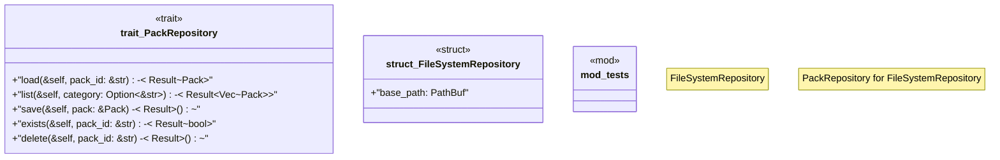

# `crates/ggen-marketplace/src/packs_registry/repository.rs`

Source SHA-256: `4def6fe1e860f5243be1fbb06cbd20b48c36c1f36e5a19d1a596f0b1c18fe921`

## Dependencies

- `async_trait::async_trait`
- `crate::marketplace::error::{Error, Result}`
- `crate::packs_registry::types::Pack`
- `crate::packs_registry::types::{PackMetadata, PackTemplate}`
- `std::collections::HashMap`
- `std::path::PathBuf`
- `super::*`

## Standing

- Structural parse: `ALIVE`
- Runtime behavior: `UNKNOWN`
