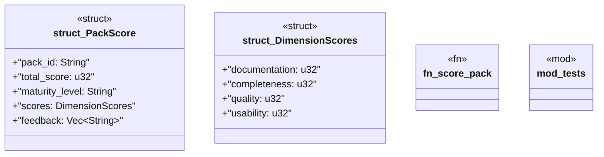

# `crates/ggen-marketplace/src/packs_registry/score.rs`

Source SHA-256: `f5dda5dd8fe3ea779c7f4e9d94ce4275726ae646b404631b555efc911dcc5e91`

## Dependencies

- `crate::marketplace::error::Result`
- `crate::packs_registry::types::Pack`
- `crate::packs_registry::types::{PackMetadata, PackTemplate}`
- `serde::{Deserialize, Serialize}`
- `std::collections::HashMap`
- `super::*`

## Standing

- Structural parse: `ALIVE`
- Runtime behavior: `UNKNOWN`
