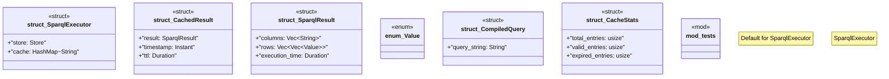

# `crates/ggen-marketplace/src/packs_registry/sparql_executor.rs`

Source SHA-256: `fdb9975388b75fcb2edfedc2a0cf8ef585dd3ad4c8dfc4ee44a0f6e19f937129`

## Dependencies

- `crate::marketplace::error::{Error, Result}`
- `crate::packs_registry::types::Pack`
- `crate::packs_registry::types::{PackDependency, PackMetadata, PackTemplate}`
- `oxigraph::model::*`
- `oxigraph::sparql::QueryResults`
- `oxigraph::store::Store`
- `serde::{Deserialize, Serialize}`
- `std::collections::HashMap`
- `std::time::{Duration, Instant}`
- `super::*`
- `tracing::{debug, info}`

## Standing

- Structural parse: `ALIVE`
- Runtime behavior: `UNKNOWN`
