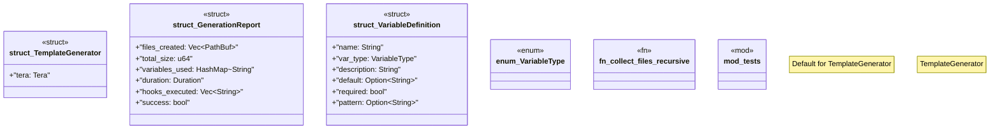

# `crates/ggen-marketplace/src/packs_registry/template_generator.rs`

Source SHA-256: `dd875f1968e39c6c7604d55c70d34f6bd2744167359d8273a02499c83c8ce08f`

## Dependencies

- `crate::marketplace::error::{Error, Result}`
- `crate::packs_registry::types::{Pack, PackTemplate}`
- `serde::{Deserialize, Serialize}`
- `std::collections::HashMap`
- `std::path::{Path, PathBuf}`
- `std::time::{Duration, Instant}`
- `super::*`
- `tera::{Context, Tera}`
- `tracing::{debug, info, warn}`

## Standing

- Structural parse: `ALIVE`
- Runtime behavior: `UNKNOWN`
