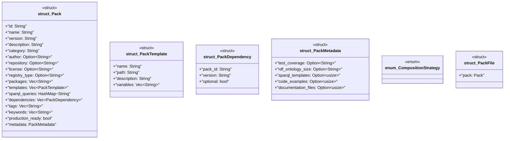

# `crates/ggen-marketplace/src/packs_registry/types.rs`

Source SHA-256: `c69186f207040a8ce84527ddf8eedc501258b89a615f1fa57b9026fc6ed0f8ba`

## Dependencies

- `serde::{Deserialize, Serialize}`
- `std::collections::HashMap`

## Standing

- Structural parse: `ALIVE`
- Runtime behavior: `UNKNOWN`
