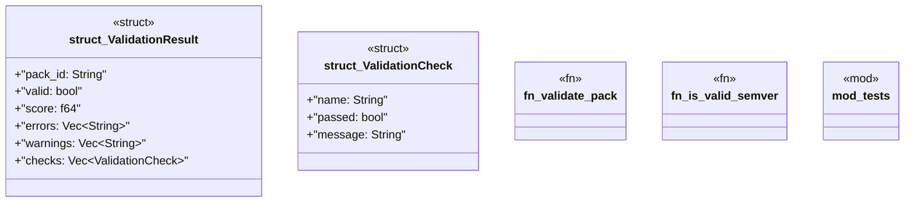

# `crates/ggen-marketplace/src/packs_registry/validate.rs`

Source SHA-256: `9b56127cc3b27aa868b1d01b033cbdb10441dec872f079c1152fe0dee2c5c6f8`

## Dependencies

- `crate::marketplace::error::Result`
- `crate::packs_registry::metadata::load_pack_metadata`
- `serde::{Deserialize, Serialize}`
- `super::*`

## Standing

- Structural parse: `ALIVE`
- Runtime behavior: `UNKNOWN`
