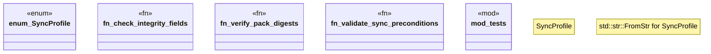

# `crates/ggen-marketplace/src/sync_profile.rs`

Source SHA-256: `209566f4b641308505de03eba7a5beb2dfcca354a1c5cf63773513b5f5c629f6`

## Dependencies

- `chrono::Utc`
- `crate::marketplace::install::compute_pack_digest`
- `crate::packs::lockfile::{LockedPack, PackLockfile, PackSource}`
- `crate::packs::lockfile::{PackLockfile, PackSource}`
- `crate::packs_registry::metadata::load_pack_metadata`
- `crate::packs_registry::types::Pack`
- `serial_test::serial`
- `std::collections::HashMap`
- `std::fs`
- `std::str::FromStr`
- `super::*`
- `tempfile::TempDir`

## Standing

- Structural parse: `ALIVE`
- Runtime behavior: `UNKNOWN`
