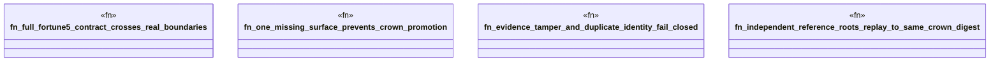

# `crates/ggen-marketplace/tests/fortune5_required_capabilities.rs`

Source SHA-256: `77753e6294356bdbd0b2a224d02326bd15d304e4c96794e0cdd9eed7f3d87f9d`

## Dependencies

- `ggen_marketplace::marketplace::fortune5::{ Fortune5Capability, Fortune5EvidenceLedger, Fortune5EvidenceOutcome, Fortune5EvidenceRecord, Fortune5ProofSurface, Fortune5Reference, Fortune5Standing, ALL_FORTUNE5_CAPABILITIES, REQUIRED_PROOF_SURFACES, }`
- `std::fs`

## Standing

- Structural parse: `ALIVE`
- Runtime behavior: `UNKNOWN`
