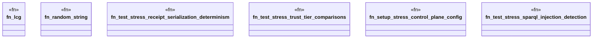

# `crates/ggen-marketplace/tests/m2_challenger_stress_tests.rs`

Source SHA-256: `0a1905f0506817ef3137ce93bda76bf59b91811aa4f0f049921a01f43dc47846`

## Dependencies

- `chrono::Utc`
- `ggen_config::ReceiptChain`
- `ggen_marketplace::marketplace::{ composition_receipt::{CompositionReceipt, OwnershipRecord, RuntimeProfile}, models::{Package, PackageId, PackageMetadata, PackageVersion, ReleaseInfo}, rdf::poka_yoke::SparqlQuery, rdf::rdf_control::{ControlPlaneError, RdfControlPlane}, rdf_mapper::RdfMapper, trust::{RegistryClass, RegistryType, TrustTier}, validation::{ReadmeValidator, Validator}, }`
- `oxigraph::store::Store`
- `std::collections::BTreeMap`
- `std::path::PathBuf`
- `std::sync::Arc`

## Standing

- Structural parse: `ALIVE`
- Runtime behavior: `UNKNOWN`
