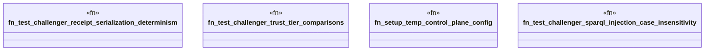

# `crates/ggen-marketplace/tests/m2_challenger_tests.rs`

Source SHA-256: `38030b744a6b9cba28dcebdeff7c611e07c3aaf4cc12e47dc94d2f2aa6149c6a`

## Dependencies

- `chrono::Utc`
- `ggen_config::ReceiptChain`
- `ggen_marketplace::marketplace::{ compatibility::{CompatibilityDimension, Conflict, ConflictSeverity}, composition_receipt::{CompositionReceipt, RuntimeProfile}, models::{Package, PackageId, PackageMetadata, PackageVersion, ReleaseInfo}, profile::{CustomProfileEntry, ProfileConfig, ReceiptSpec, RuntimeConstraint}, rdf::poka_yoke::SparqlQuery, rdf::rdf_control::{ControlPlaneError, RdfControlPlane}, rdf_mapper::RdfMapper, trust::{RegistryClass, RegistryType, TrustTier}, validation::{ReadmeValidator, Validator}, }`
- `oxigraph::store::Store`
- `std::collections::BTreeMap`
- `std::path::PathBuf`
- `std::sync::Arc`

## Standing

- Structural parse: `ALIVE`
- Runtime behavior: `UNKNOWN`
