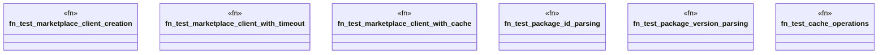

# `crates/ggen-marketplace/tests/marketplace_phase4_integration.rs`

Source SHA-256: `ab91ba74f52c4522ce8e233ecf1ce0ee298b7780e5810739897e2a1375de840c`

## Dependencies

- `ggen_marketplace::marketplace::cache::{CacheConfig, PackCache}`
- `ggen_marketplace::marketplace::network::MarketplaceClient`
- `ggen_marketplace::marketplace::{PackageId, PackageVersion}`
- `std::sync::Arc`
- `std::time::Duration`
- `tempfile::TempDir`

## Standing

- Structural parse: `ALIVE`
- Runtime behavior: `UNKNOWN`
