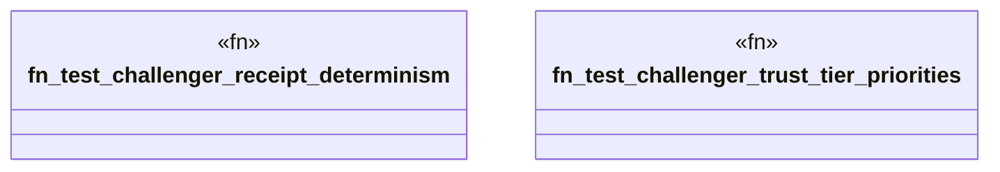

# `crates/ggen-marketplace/tests/milestone2_challenger_tests.rs`

Source SHA-256: `0698e3aaa4de2a9c98cc4ba6a59054dfd0621ddae75fd0af8eeffd41980d171a`

## Dependencies

- `chrono::Utc`
- `ggen_marketplace::marketplace::composition_receipt::{CompositionReceipt, RuntimeProfile}`
- `ggen_marketplace::marketplace::models::{ Package, PackageId, PackageMetadata, PackageVersion, ReleaseInfo, }`
- `ggen_marketplace::marketplace::rdf_mapper::RdfMapper`
- `ggen_marketplace::marketplace::trust::{RegistryClass, RegistryType, TrustTier}`
- `ggen_marketplace::marketplace::validation::{ReadmeValidator, Validator}`
- `oxigraph::store::Store`
- `std::sync::Arc`

## Standing

- Structural parse: `ALIVE`
- Runtime behavior: `UNKNOWN`
