# `crates/ggen-marketplace/tests/namespace_consistency_test.rs`

Source SHA-256: `95e2ddb9f4247ba319d971ede85c50d85e193b8d723355fae6e6d5628b47b130`

```mermaid
classDiagram
    class fn_package_uri {
      <<fn>>
    }
    class fn_insert_canonical_package {
      <<fn>>
    }
    class fn_count_solutions {
      <<fn>>
    }
    class fn_test_inserted_package_is_findable_by_query_builder {
      <<fn>>
    }
    class fn_test_package_name_uri_agrees_across_insert_and_query_sides {
      <<fn>>
    }
    class fn_test_legacy_dc_title_predicate_finds_nothing_against_canonical_data {
      <<fn>>
    }
    class fn_test_data_properties_have_no_uri_local_name_drift {
      <<fn>>
    }
```

## Dependencies

- `ggen_marketplace::marketplace::ontology::{Classes, Properties, MARKETPLACE_NS}`
- `ggen_marketplace::marketplace::rdf::ontology::Property`
- `ggen_marketplace::marketplace::rdf::sparql_queries::{MarketplaceQueries, SearchParams}`
- `oxigraph::sparql::{QueryResults, SparqlEvaluator}`
- `oxigraph::store::Store`

## Standing

- Structural parse: `ALIVE`
- Runtime behavior: `UNKNOWN`
