# `crates/ggen-marketplace/tests/part_passport_fixture.rs`

Source SHA-256: `bd4fb37050fa84ef54eef03634823db342ab751a3bd73d2900110fb48fd59c9b`

```mermaid
classDiagram
    class fn_passport {
      <<fn>>
    }
    class fn_manufactured_fixture_is_admitted {
      <<fn>>
    }
    class fn_manufactured_nameplate_exposes_the_causal_rating {
      <<fn>>
    }
    class fn_rust_projection_derives_equivalent_nameplate_marks {
      <<fn>>
    }
    class fn_invalid_digest_is_refused_before_substitution {
      <<fn>>
    }
    class fn_widened_authority_breaks_interchangeability {
      <<fn>>
    }
    class fn_lower_resource_draw_preserves_substitutability {
      <<fn>>
    }
```

## Dependencies

- `ggen_marketplace::marketplace::{ PartPassport, PassportViolationCode, SubstitutionViolationCode, }`

## Standing

- Structural parse: `ALIVE`
- Runtime behavior: `UNKNOWN`
